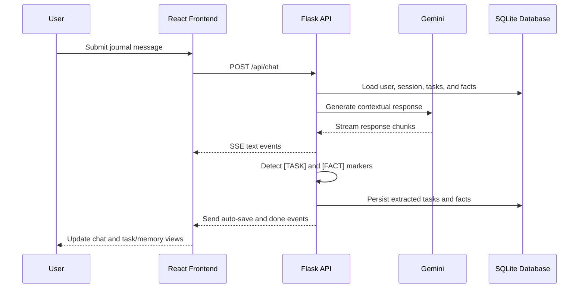
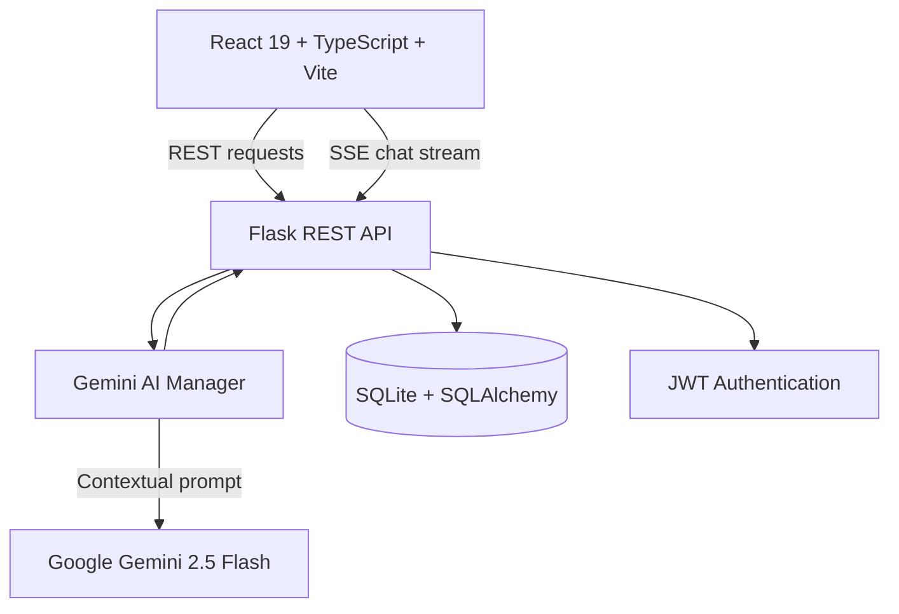
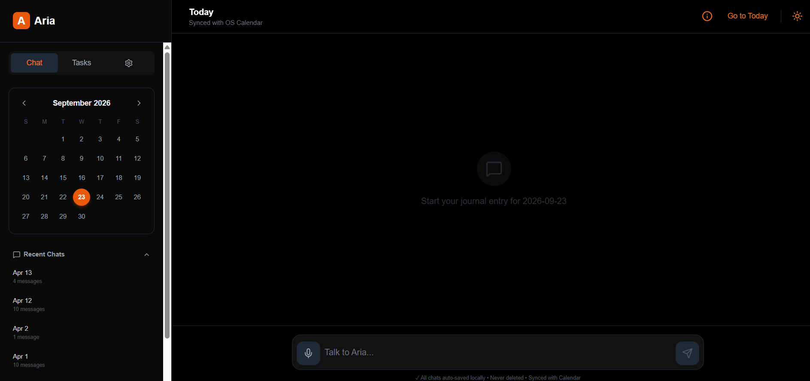
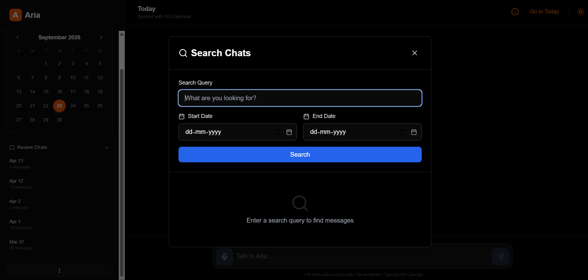
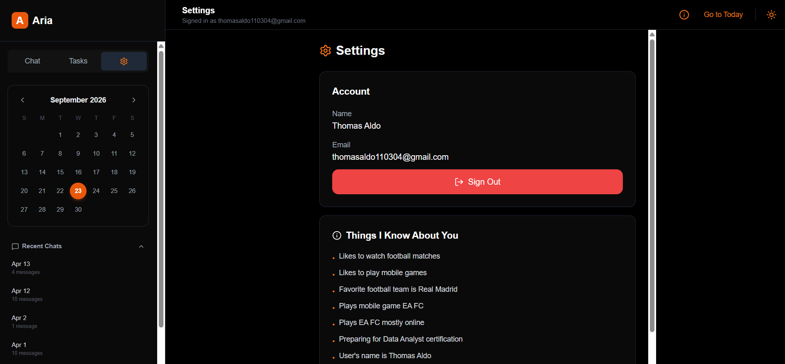

# ARIA — Private, Journal Based, AI-Enhanced Personal Assistant

<p align="center">
  
</p>

### A privacy-conscious, journal-based AI companion for conversations, memory, and task management.

[](https://github.com/ThomasAldo/ARIA-AI)
[](https://react.dev/)
[](https://vite.dev/)
[](https://flask.palletsprojects.com/)
[](https://ai.google.dev/)
[](https://www.sqlite.org/)
[](https://developer.mozilla.org/en-US/docs/Web/API/Server-sent_events)

> ARIA is a full-stack AI journaling and personal productivity assistant that combines daily conversations, long-term memory, task management, and searchable journal sessions in one focused interface.


## Contents

- [Why ARIA](#why-aria)
- [Highlights](#highlights)
- [How It Works](#how-it-works)
- [Architecture](#architecture)
- [Technology Stack](#technology-stack)
- [Repository Structure](#repository-structure)
- [Core Data Model](#core-data-model)
- [AI and Memory](#ai-and-memory)
- [API Overview](#api-overview)
- [Quick Start](#quick-start)
- [Configuration](#configuration)
- [Testing](#testing)
- [Privacy and Security](#privacy-and-security)
- [Current Limitations](#current-limitations)
- [Roadmap](#roadmap)
- [License](#license)

---

## Why ARIA

Personal journals, reminders, plans, and reflections contain sensitive information. A useful assistant needs context and memory, but storing every interaction in a centralized cloud platform can increase privacy and security risks.

ARIA explores a more controlled assistant architecture by combining:

- Daily, date-based journal sessions
- User-scoped tasks and long-term facts
- Local SQLite persistence by default
- Backend-mediated AI requests
- Streamed responses for a responsive experience
- Search, export, and deletion tools for user-owned conversations

The goal is to make an AI assistant more useful without making the user's personal data invisible or difficult to manage.

---

## Highlights

### Conversational journaling

- Record thoughts naturally through a chat interface.
- Organize conversations by date.
- Revisit previous journal sessions from the sidebar calendar.
- Display streamed assistant responses as they arrive.
- Switch between light and dark themes.

### AI-assisted memory

ARIA can identify useful personal information from conversations and store it as user-specific facts, such as interests, preferences, hobbies, or important details.

### Task management

- Create tasks manually or through conversation.
- Mark tasks as completed.
- Delete tasks.
- Add optional due dates.
- Display overdue, due today, due tomorrow, and upcoming states.

### Session management

- Rename conversations.
- Delete individual sessions.
- Delete sessions by date.
- Clear all sessions.
- Generate summaries for completed sessions.
- Search messages by keyword and date range.
- Export sessions as plain text, Markdown, or JSON.

### Voice input

Use the browser's Web Speech API to dictate a journal entry or task directly into the chat input.

### Authentication

- User signup and login
- Password hashing with Werkzeug
- JWT token generation and verification
- Client-side authentication state management

---

## How It Works



A typical interaction follows this flow:

1. The user signs in and selects a journal date.
2. The frontend sends a message to the Flask backend.
3. The backend loads relevant user context from SQLite.
4. ARIA builds a context-aware Gemini prompt.
5. Gemini generates a streamed response.
6. Flask forwards response chunks to the frontend using Server-Sent Events.
7. The backend extracts task and fact markers from the completed response.
8. New tasks or facts are saved for the current user.
9. The interface refreshes the relevant task and memory views.

---

## Architecture



### Architectural layers

| Layer | Responsibility |
|---|---|
| Presentation | Chat UI, calendar navigation, tasks, settings, search, voice input, and themes |
| API | Authentication, chat streaming, task/fact operations, session management, search, summaries, and exports |
| Intelligence | Prompt construction, context assembly, Gemini response streaming, and task/fact extraction |
| Persistence | Users, sessions, messages, tasks, and facts stored through SQLAlchemy |

---

## Technology Stack

| Area | Technology | Role |
|---|---|---|
| Frontend | React 19 | Component-based application interface |
| Language | TypeScript | Type-safe frontend development |
| Build tool | Vite | Development server and production bundling |
| Backend | Flask 3.0 | REST API and streaming response server |
| AI | Google Gemini 2.5 Flash | Context-aware response generation |
| Persistence | SQLite | Local, low-maintenance database |
| ORM | SQLAlchemy 2.0 | Database models and queries |
| Authentication | PyJWT + Werkzeug | JWT handling and password hashing |
| Streaming | Server-Sent Events | Token-by-token response delivery |
| Icons | lucide-react | User interface icons |
| Voice | Web Speech API | Browser voice input |

---

## Repository Structure

```text
ARIA-AI/
├── App.tsx                    # Main React application
├── index.tsx                  # React entry point
├── index.html                 # Vite HTML template
├── types.ts                   # Shared frontend types
├── package.json               # Frontend dependencies and scripts
├── tsconfig.json              # TypeScript configuration
├── vite.config.ts             # Vite configuration
│
├── components/
│   ├── Calendar.tsx           # Journal date selector
│   ├── ChatManager.tsx        # Session management modal
│   ├── ChatSearch.tsx         # Conversation search interface
│   ├── ChatSessions.tsx       # Sidebar session list
│   ├── Icons.tsx              # Reusable icon exports
│   ├── LoginScreen.tsx        # Authentication screen
│   └── TaskInput.tsx          # Manual task input
│
├── services/
│   ├── api.ts                 # Flask API and SSE client
│   ├── authService.ts         # Signup, login, JWT, and user state
│   ├── geminiService.ts       # Client-side Gemini prototype/alternate flow
│   └── storageService.ts      # Browser localStorage helpers
│
├── backend/
│   ├── app.py                 # Flask application and API routes
│   ├── ai_manager.py          # Gemini context and response generation
│   ├── models.py              # SQLAlchemy models
│   ├── requirements.txt       # Python dependencies
│   ├── setup.py               # Backend package configuration
│   ├── test_api.py            # AI response smoke test
│   └── test_chat.py           # Chat endpoint smoke test
│
└── docs/
    └── demo-screenshot.png    # Optional README demo image
```

---

## Core Data Model

ARIA uses five primary database entities:

| Entity | Purpose |
|---|---|
| `User` | Account identity, email, display name, password hash, and creation time |
| `ChatSession` | A date-based journal conversation with optional title and summary |
| `Message` | Individual user or assistant messages within a session |
| `Task` | User-owned tasks with completion state and optional due date |
| `Fact` | User-owned long-term memory entries extracted from conversations |

User-owned records are connected through SQLAlchemy relationships and scoped using user identifiers.

---

## AI and Memory

The backend assembles model context from relevant application data, including:

- Current user message
- Current session history
- User name
- Saved facts
- Active tasks
- Recent previous sessions
- Existing session summaries
- Selected journal date

The active backend chat path uses marker-based extraction:

```text
[TASK] Call the dentist [/TASK]
[FACT] User enjoys long walks [/FACT]
```

After a response is generated, the backend:

1. Detects task and fact markers.
2. Validates that the extracted content is non-empty.
3. Stores new records in SQLite.
4. Removes the markers from the displayed assistant message.
5. Emits an `auto_save` event to the frontend.

> Structured Gemini function declarations are also present in the repository as an alternate/prototype flow. The primary backend chat endpoint currently uses marker-based extraction.

---

## API Overview

### Health

```text
GET /api/health
```

### Authentication

```text
POST /api/auth/signup
POST /api/auth/login
GET  /api/auth/verify
```

### Application state

```text
GET /api/state
```

### Chat

```text
POST /api/chat
```

Example request:

```json
{
  "user_id": "user-id",
  "message": "Remind me to call my supervisor",
  "date": "2026-09-23"
}
```

The response is an SSE stream containing events such as:

```json
{"type":"text","text":"I have added that reminder."}
```

```json
{"type":"tool_call","tool":"auto_save","summary":"Created 1 task(s)"}
```

```json
{"type":"done"}
```

### Tasks

```text
GET   /api/tasks
POST  /api/tasks
PATCH /api/tasks/<task_id>
```

### Facts

```text
GET  /api/facts
POST /api/facts
```

### Chat sessions

```text
GET    /api/chat_sessions
PATCH  /api/chat_sessions/<session_id>
DELETE /api/chat_sessions/<session_id>
DELETE /api/chat_sessions/by_date
DELETE /api/chat_sessions/clear_all
POST   /api/chat_sessions/<session_id>/summary
GET    /api/chat_sessions/<session_id>/export
```

### Search

```text
GET /api/chat/search
```

Supports keyword queries and optional date filters.

---

## Quick Start

### Prerequisites

- Node.js 18 or later
- npm
- Python 3.10 or later
- A Google Gemini API key

### 1. Clone the repository

```bash
git clone https://github.com/ThomasAldo/ARIA-AI.git
cd ARIA-AI
```

### 2. Install frontend dependencies

```bash
npm install
```

### 3. Set up the backend

```bash
cd backend
python -m venv venv
```

macOS/Linux:

```bash
source venv/bin/activate
```

Windows PowerShell:

```powershell
venv\Scripts\activate
```

Install Python dependencies:

```bash
pip install -r requirements.txt
```

### 4. Configure environment variables

Create `backend/.env`:

```env
GEMINI_API_KEY=your_gemini_api_key
JWT_SECRET_KEY=replace_with_a_secure_random_value
JWT_EXPIRATION_HOURS=24
DATABASE_URL=sqlite:///aria.db
```

### 5. Start the backend

From the `backend/` directory:

```bash
python app.py
```

The API runs at:

```text
http://localhost:5000
```

### 6. Start the frontend

Open a second terminal at the repository root:

```bash
npm run dev
```

The frontend normally runs at:

```text
http://localhost:5173
```

<details>
<summary><strong>Available frontend commands</strong></summary>

```bash
npm run dev      # Start the Vite development server
npm run build    # Create a production build
npm run preview  # Preview the production build locally
```

</details>

---

## Configuration

The frontend uses the following optional environment variable:

```env
VITE_API_URL=http://localhost:5000
```

The backend uses:

| Variable | Required | Description |
|---|---:|---|
| `GEMINI_API_KEY` | Yes | API key used for Gemini response generation |
| `JWT_SECRET_KEY` | Recommended | Secret used to sign JWT tokens |
| `JWT_EXPIRATION_HOURS` | No | JWT lifetime; defaults to 24 hours |
| `DATABASE_URL` | Optional | Database URL; SQLite is the default configuration |

Never commit `.env` files, API keys, or production credentials.

---

## Testing

The repository currently includes backend smoke-test scripts:

```bash
cd backend
python test_api.py
python test_chat.py
```

These scripts require the backend environment and dependencies to be configured. They are intended for manual validation of AI response generation, user creation, streaming chat, tasks, and facts.

Comprehensive automated unit and integration testing is planned as part of the project's ongoing development.

---

## Privacy and Security

ARIA is designed with privacy-conscious principles:

- SQLite is used for local application persistence by default.
- Passwords are hashed using Werkzeug.
- JWT authentication components are included.
- User-owned records are associated with user identifiers.
- The Gemini API key is intended to remain on the backend.
- Sessions can be searched, exported, renamed, or deleted.
- The application does not include built-in cloud synchronization.

### Important data-handling note

The application sends conversation content and selected context to the configured Google Gemini API for response generation. Therefore, ARIA should be described as **local-persistence-oriented and privacy-conscious**, not as a fully offline assistant.

For production deployments, consider adding:

- HTTPS
- Strict JWT authorization on every user-data endpoint
- Strong secret management
- Restricted CORS origins
- Rate limiting
- Encrypted database storage
- Input validation and sanitization
- Secure production logging
- Removal of debug configuration

---

## Current Limitations

- Some data endpoints currently accept `user_id` directly instead of deriving it exclusively from the JWT.
- SQLite is best suited to local and small-scale deployments.
- Google Calendar synchronization is not currently implemented; calendar-related behavior is limited to journal date navigation and prototype simulation.
- The active backend task/fact flow uses response markers rather than fully structured tool execution.
- The repository contains a client-side Gemini prototype/alternate flow in addition to the backend-mediated flow.
- Automated test coverage is currently limited.
- Large-scale search and indexing require further optimization.
- Gemini API access requires an internet connection.

---

## Roadmap

- [ ] Enforce JWT authorization across every user-data endpoint
- [ ] Replace marker parsing with fully validated structured tool calls
- [ ] Add comprehensive automated tests and continuous integration
- [ ] Add encrypted database storage
- [ ] Add configurable data retention controls
- [ ] Implement real Google Calendar integration
- [ ] Add recurring tasks and notifications
- [ ] Improve search indexing and performance
- [ ] Add database migrations
- [ ] Add Docker-based deployment
- [ ] Support local model providers for offline operation
- [ ] Add model-provider abstraction for easier AI backend switching

---

## Screenshots and Product Media

### Main Chat Interface



### Chat Search Interface



### Settings and Data Interface



## Project Status

ARIA is under active development and currently provides a functional full-stack prototype with:

- React-based journaling interface
- Flask REST API
- Gemini-powered streaming conversations
- User authentication flows
- SQLite persistence
- Task and fact management
- Date-based chat sessions
- Search and export functionality
- Voice input support
- Light and dark themes

The modular structure makes it possible to improve security, privacy controls, structured AI actions, testing, deployment, and model flexibility over time.

---

## License

This project is currently presented as an academic and experimental software project. Add a formal open-source license file, such as `MIT`, `Apache-2.0`, or `GPL-3.0`, before distributing the project for external reuse.

---

<p align="center">
  Built with React, Flask, SQLAlchemy, SQLite, and Google Gemini.
</p>

<p align="center">
  Designed to make personal AI assistance more useful, transparent, and manageable.
</p>
